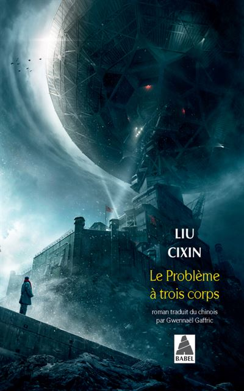

Title: SF: Trilogie du problème à trois corps
Date: 2023-08-20 09:46
Category:Inclassable
Tags: livre, roman, sf
Authors: Anthony Le Goff
Summary:

Si vous n'avez pas encore lu la trilogie du Problème à Trois Corps de l'écrivain chinois Liu Cixin, cela reste un incontournable de la lecture SF qui a obtenu le prix Hugo. Même Barack Obama l'a lu. C'est du genre "Hard SF" et parfois très technique et s'appuyant sur des vérités scientifiques.

### TOME 1 - Le Problème à trois Corps - 11€

"En pleine Révolution culturelle, le pouvoir chinois construit la base militaire secrète de Côte Rouge, destinée à développer une arme de grand calibre. Ye Wenjie, une jeune astrophysicienne en cours de “rééducation”, intègre l’équipe de recherche. Dans ce lieu isolé où elle croit devoir passer le restant de sa vie, elle est amenée à travailler sur un système de télétransmissions dirigé vers l’espace et découvre peu à peu la véritable mission de Côte Rouge…

Trente-huit ans plus tard, alors qu’une étrange vague de suicides frappe la communauté scientifique internationale, l’éminent chercheur en nanotechnologies Wang Miao est témoin de phénomènes paranormaux qui bouleversent ses convictions d’homme rationnel. Parmi eux, une inexplicable suite de nombres qui défile sur sa rétine, tel un angoissant compte à rebours…"

Lien d'achat Fnac:

[https://www.fnac.com/a12481499/Le-Probleme-a-Trois-Corps-Le-Probleme-a-trois-corps-Liu-Cixin](https://www.fnac.com/a12481499/Le-Probleme-a-Trois-Corps-Le-Probleme-a-trois-corps-Liu-Cixin)

### TOME 2 - La forêt sombre - 12€

"L’humanité le sait désormais : dans un peu plus de quatre siècles, la flotte trisolarienne envahira le système solaire. La Terre doit impérativement préparer la parade, mais également faire face aux intellectrons qui permettent aux Trisolariens d’espionner toutes les conversations et tous les ordinateurs. En revanche, ils sont incapables de lire dans l’âme humaine.

Le Conseil de défense planétaire imagine donc un nouveau projet : le programme Colmateur. Quatre individus seront chargés d’élaborer chacun de leur côté des stratégies pour contrer l’invasion ennemie. Livrés à eux-mêmes, ils devront penser seuls, et brouiller les pistes. Trois des hommes désignés sont des personnalités politiques et des scientifiques émi-nents, mais le quatrième est un parfait anonyme. Ce dernier ignore totalement la raison pour laquelle on lui confie cette mission. Tout ce qu’il sait, c’est qu’il est désormais l’un des Colmateurs, et que les Trisolariens veulent sa mort."

Lien d'achat Fnac:

[https://www.fnac.com/a13456267/Le-Probleme-a-Trois-Corps-La-Foret-sombre-Liu-Cixin](https://www.fnac.com/a13456267/Le-Probleme-a-Trois-Corps-La-Foret-sombre-Liu-Cixin)

### TOME 3 - La mort immortelle - 13€

"Un demi-siècle après l’Ultime Bataille, l’équilibre précaire dû à la dissuasion de la forêt sombre continue de maintenir les envahisseurs trisolariens à distance. La Terre jouit d’une prospérité sans précédent grâce au transfert des connaissances et des technologies trisolariennes. La science humaine connaît des progrès pour ainsi dire quotidiens, les Trisolariens découvrent avec fascination une nouvelle culture et l’espoir grandit que les deux civilisations puissent bientôt coexister pacifiquement sans la terrible menace d’une annihilation réciproque.

Mais lorsqu’une ingénieure en aéronautique originaire du début du XXIe siècle sort de son hibernation, elle réveille avec elle le souvenir d’un programme qui menace cet équilibre. Bientôt, l’humanité aura à faire un choix : partir à la conquête d’autres univers ou mourir dans son berceau."

Liend d'achat Fnac:

[https://www.fnac.com/a15028255/Le-Probleme-a-Trois-Corps-La-Mort-immortelle-Liu-Cixin](https://www.fnac.com/a15028255/Le-Probleme-a-Trois-Corps-La-Mort-immortelle-Liu-Cixin)

