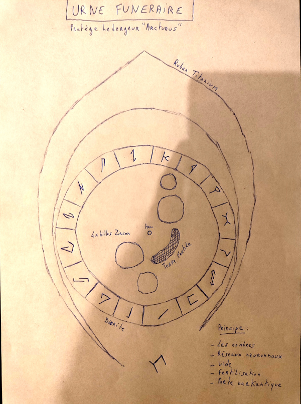

Title:Voile et annihilation: l'urne funéraire narkantique
Date: 2023-08-28 19:38
Category:Inclassable
Tags:urne
Authors: Anthony Le Goff
Summary:

Parlons un peu d'architecture, et de ce que j'ai inventé pour "Voile et Annihilation". Comme je dis le narkantisme est une nouvelle religion comme secte islamique avec sa propre divinité: "Alba" qui prends la forme d'une méduse quand elle se matérialise.

J'avais commencé à dessiné en prison l'architecture des temples Narkantiques "Kor", et le prototype Exekias qui enferme une crypte: un cube (Kaaba) de 22 m x 22 m x 22 m avec des pieux générants une cage en son centre disposant un planétaire avec des orbes en lévitation. Et un hologramme de méduse qui ce balade dans le champs comme gardien.

La crypte du temple renferme l'hébergeur Arcturus du religieux: un *Ayarater* ou est conservé son ADN qui transmute avec celui de la méduse. A la base d'une capsule temporelle qui est un miniaturisation dans un univers imbriqué d'un cosmos et de la création. C'est à dire que le temple sert de portail vers ce nouveau monde. Mais personne n'y à accès sans l'Urashuangshiji. Et les religieux narkantiques sont éduqués via le livre sacré.

Au centre du cube scellé au sol un marche-pied renferme l'hébergeur Arcturus dans une urne funéraire. Dont j'ai moi-même inventé le design et le symbolisme. Je suis très sobre et minimaliste. Pas de Touthankamon et de tombeau pharaonique.

L'urne n'a pas de nom, ce n'est pas nominatif, le seul symbole de signe d'appartenance à la religion narkantique est la séquence des nombres nakantiques en base 16 scellé par la clé glyphique de la porte narkantique "Tetz".

Les nombres narkantiques ne sont pas secrets c'est à ça que l'on reconait l'empreinte d'appartenance à la religion dans le rite. C'est un peu l'adresse IP public du serveur. Au niveau de la calligraphie, c'est des runes classiques. Le "zéro" s'écrit comme un carré ouvert, et le "un" comme une ligne, puis la suite des chiffres se complexifient.

L'urne est en diorite, c'est un souvenir de l'Egypte antique comme pierre la plus solide, niveau dureté de couleur noir. Elle est gravé, il y a quelques cavités, un trou et les nombres narkantiques ainsi qu'une forme de rainure pour mettre un fin ruban en titane plat. Elle est façonné pour s'ouvrir et y mettre l'hébergeur Arcturus.

Par principes elles symbolisent:

* Les nombres, le calcul et la quantification
* Réseaux neuronaux
* Vide
* Fertilisation et agriculture avec de la Terre comme poussière
* Porte nakantique en titane
* L'alliance avec l'anneau par les nombres
* Orbes planétaires pour l'horloge céleste en Zircon (elles suivent une symétrie à travers le vide, et un pont fertile de poussière)

C'est de la cosmologie et comment est défini la création. 

Un temple narkantique nécessite des millions € pour créer la crypte et le prototype Exekias, c'est de la pierre et du granite que j'ai défini dans mes carnets en prison. La base du temple supporte un monolithe noir métallique de 666 m de haut. 

---

