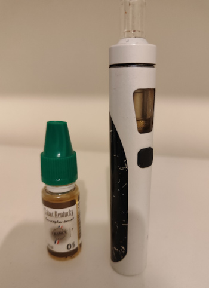
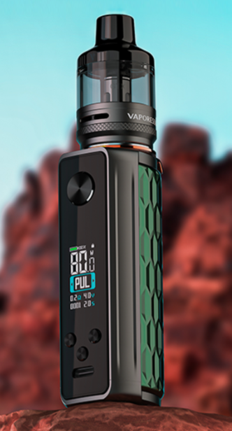
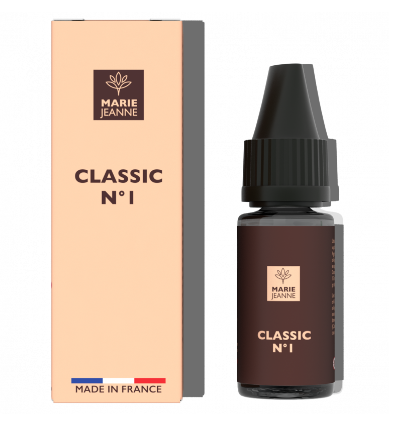

Title:Je me remets à vapoter
Date: 2023-11-13 19:53
Category:Inclassable
Tags:vape
Authors: Anthony Le Goff
Summary:

C'est décidé je me remets à vapoter. J'avais commencé à vapoter en prison, je mettais mis aussi à la cigarette car je faisais des expériences avec le tabac et la fumée. Je cherchais à comprendre certain phénomène.

Donc voila j'avais arrêté de vapoter, je faisais un peu en hopital psychiatrique mais ma e-cigarette n'était pas génial et cela me brulait parfois la gorge. Ce que j'avais pas se souci avec une autre e-cigarette en prison. 

Pourquoi donc vapoter? En règle générale j'ai trouvé que je trouvais mon inspiration dans les vapeurs de fumée, cela stimulait ma créativité, et j'ai été très créatif en prison, cela a été efficace. Cela me manque un peu que d'être nébuleux, et observer la vapeur de fumée autour de moi.

Voila mon petit kit actuel, mon e-liquide est saveur Kentucky sans nicotine.

J'ai décidé de prendre un bon produit de pro et me mettre au CBD et donc au cannabis. On dit que dans la secte des assassins islamique ont donne du cannabis pour conditionner les partisans. Alors je me suis dis pourquoi pas me mettre au CBD pour ces vertu relaxante et cela pourrait m'aider à la concentration dans mes travaux. 

J'en ai eu pour 67€ en e-cigarette et 2x e-liquide. J'ai acheté chez [vapoteuse.fr](https://www.vapoteuse.fr/) ou il y avait des réductions. J'ai pris l'une des meilleurs e-cigarette sur le marché la [TARGET 80 GTX de Vaporesso](https://www.vaporesso.com/fr/vape-kits/target-80) avec un affichage LCD pour le réglage à 41€.

Pour l'e-liquide j'ai pris [E-LIQUIDE CLASSIC N°1 CBD MARIE JEANNE Tbc Blond](https://mariejeanne-cbd.com/fr/e-liquides-cbd/19-96-e-liquide-classic-n1.html#/dosage,300mg-30mg-ml), une marque française avec un dosage moyen à 300mg. Ce qui fait que c'est un peu cher. un e-liquide normal cout 5€. Ici on monte à 15€. Donc j'espère que c'est de la qualité et que c'est agréable à fumer.

J'ai également acheté des résistances calibrés pour utiliser à 15W spécifique au CBD. [GTX Mesh COIL à 11€](https://www.amazon.fr/dp/B088ZYC166?psc=1&smid=A3GAYFTOXYIW66&ref_=chk_typ_imgToDp)

---

