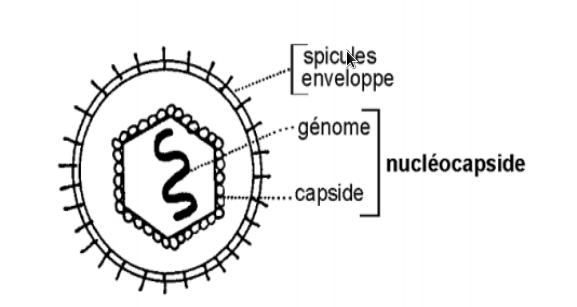

Title:Introduction aux virus
Date: 2023-10-07 11:35
Category:Inclassable
Tags:virus
Authors: Anthony Le Goff
Summary:

Je reviens sur [mon post sur la psychiatrie](https://legoffant.github.io/ce-quil-faut-faire-si-vous-etes-enferme-en-psychiatrie-sur-une-longue-duree.html). Et ce qu'il faut faire si on essaye de vous enfermer. 

En réalité ce que je fabrique est les bases de la virologie et la conception de Virus. C'est à dire on conçoit une arme à partir du génome dans une capsule. On enferme dans une matrice pour le protéger, le conserver et le faire transmuter. L'intérêt est d'être indectable, un virus est furtif car c'est la structure réplicante du génome la plus petite de 10 à 300 nm, allant de quelques gènes à 1600. Le virus a une fonction d'infecté un organisme. 

Pour qu'un virus soit efficace sa fabrication doit être la plus ouverte possible et donc ces composants disponibles au plus grands nombres. Ainsi il est facile de ce procurer les matériaux. En informatique on peut également comparé cela au réseau Tor pour fabriquer le darknet en structure en oignon. C'est un noeud de routage de l'information et de l'énergie qui a une fonction de transformation que l'on ne peut pas arrêter. Un virus son principe est l'infection comme arme bactériologique. Le réseau Tor héberge les criminels, les activistes et le traffic d'arme ou toute forme d'information normalement censuré.

Vous pouvez vous inspirer de mon post pour la conception de virus à travers l'étude de l'architecture de ceux-ci comme analogie. 

