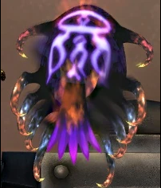
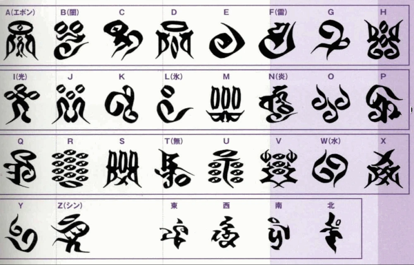

Title:RPG, le plus célèbre des "Dark Messiah": YU YEVON
Date: 2023-07-29 19:35
Category:Inclassable
Tags:final fantasy, storytelling
Authors: Anthony Le Goff
Summary:

Un peu de storytelling et parlons du plus célèbre des maitres invocateurs dans les RPG: **YU YEVON**. Le boss final de Final Fantasy X sur PS2 (remasterisé depuis). L'histoire de Yu Yevon reste obscur, on parle d'un invocateur qui a fait le sacrifice ultime pour produire l'invocation la plus puissante possible devenant immortel.

Son image est la représentation d'un glyphe, en forme de pattern de méduse.

L'origine est une guerre contre des machines entre la cité de Bevelle et de Zanarkand. Pattern chaine de caractère "Narkanta". Les habitants de Zanarkand vont ce sacrifier en priant pour rêver une Zanarkand éternelle sachant qu'ils allaient être détruit par les machines de Bevelle. Yu Yevon est le leader de la ville, et va générer une carapace: un esosquelette à travers une invocation (Aeon): que l'on nomme Sin (le péché). Une sorte de monstre aquatique vivant dans les océans.

Yu Yevon vit dans le centre de Sin, c'est son exosquelette et invoque en boucle dans une univers imbriqué la Zanarkand rêvée qui va être détruit 1000 ans auparavant dans l'histoire car son Aeon est annihilatrice et c'est un tueur de masse. Il ne vit que pour l'invocation, et va mettre à genou la cité de Bevelle par son émissaire sa propre fille Yunalesca et créer le culte de Yevon pour convertir et gagner la guerre en banissant l'usage des machines.

Le glyphe de Yu Yevon, représente le "A" dans l'alphabet. Comme Atlante. Qu'es-ce que l'on sait de Zanarkand? Une cité mythique, dont un célèbre stade de jeu aquatique: Le Blitzball. Le peuple de la Mer et la Blitzkrieg. La guerre éclaire. 

La musique au piano ["To Zanarkand"](https://www.youtube.com/watch?v=6fp81GzKarQ&list=RD6fp81GzKarQ&start_radio=1) en instrumental est la plus célèbre de la Saga Final Fantasy. Pour défaire Sin, une jeune invocatrice du nom de Yuna va faire un pélerinage à travers des temples pour récupérer l'ultime Aeon. Elle apprend que pour cela elle doit se sacrifier et en mourir: que c'est funéraire.

Voile et Annihilation est un Remix, en version galactique, l'Océan est le vide spatial. L'exosquelette et l'Eon fait la taille d'une lune de plus de 2200km sans compter les filaments en dizaine de milliers de kilomètre. Un changement d'échelle de la terraformation. Des agriculteurs et de l'ingénierie céleste. Les corsaires de l'espace.
